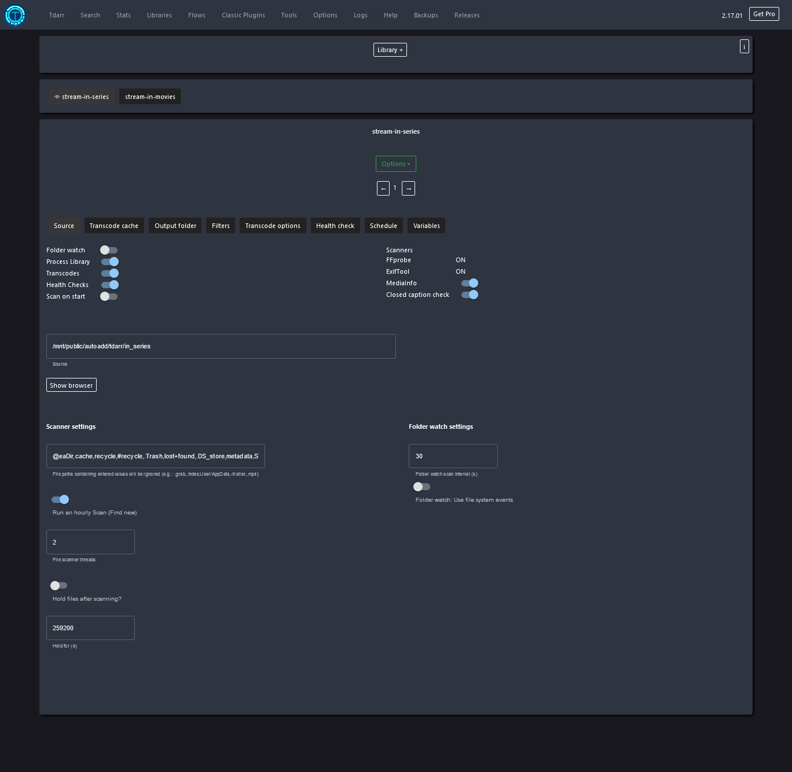
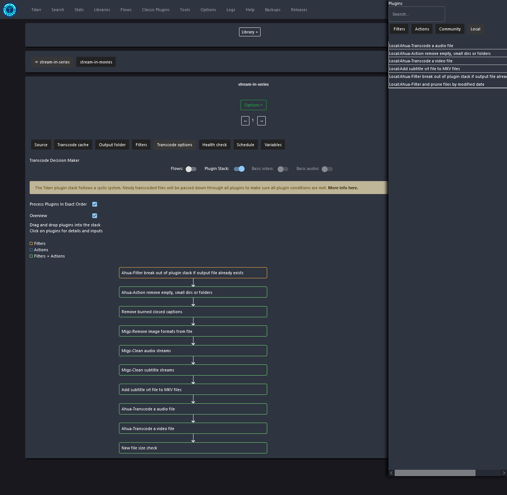
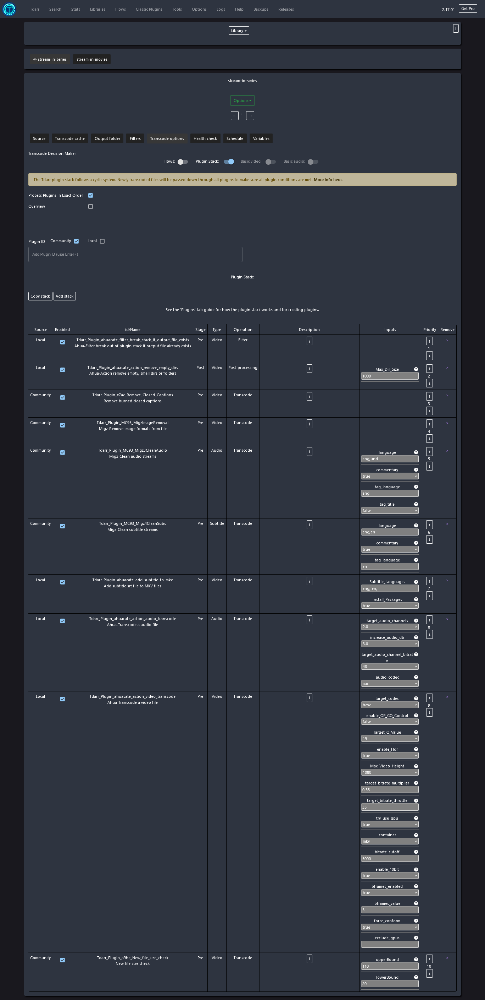

<h1>PVE Medialab</h1>

Medialab focuses on everything related to Home Media, providing a range of PVE CT-based applications such as Sonarr, Radarr, Jellyfin, and more. In addition, it offers an Easy Script Installer and Toolbox that automates many of the tasks, accompanied by step-by-step instructions.

However, before you begin using Medialab, it's crucial to ensure that your network, hardware, and NAS setup meet the prerequisites outlined in our guide. It's essential to read and follow this guide before proceeding.

<h2>Prerequisites</h2>

Read about our <a href="https://github.com/ahuacate/common/tree/main/pve/src/local_about_our_build.md" target="_blank">system-wide requirements</a> before proceeding any further.

**Network Prerequisites**
- [ ] Layer 2/3 Network Switches

**PVE Host Prerequisites**
- [x] PVE Host is configured to our [build](https://github.com/ahuacate/pve-host)
- [x] PVE Host Backend Storage mounted to your NAS:
	- nas-0X-backup
	- nas-0X-books
	- nas-0X-downloads
	- nas-0X-music
	- nas-0X-photo
    - nas-0X-public
	- nas-0X-transcode
	- nas-0X-video
	
	You must have a running network File Server (NAS) with ALL of the above NFS and/or CIFS backend share points configured on your PVE host pve-01.

**Optional Prerequisites**
- [ ] pfSense with working OpenVPN Gateways VPNGATE-LOCAL (VLAN30) and VPNGATE-WORLD (VLAN40).

<h2>Local DNS Records</h2>

Before proceeding, we <span style="color:red">strongly advise</span> that you familiarize yourself with network Local DNS and the importance of having a PiHole server. To learn more, click <a href="https://github.com/ahuacate/common/tree/main/pve/src/local_dns_records.md" target="_blank">here</a>.

It is essential to set your network's Local Domain or Search domain. For residential and small networks, we recommend using only top-level domain (spTLD) names because they cannot be resolved across the internet. Routers and DNS servers understand that ARPA requests they do not recognize should not be forwarded onto the public internet. It is best to select one of the following names: local, home.arpa, localdomain, or lan only. We strongly advise against using made-up names.

<h2>Easy Scripts</h2>

Easy Scripts simplify the process of installing and configuring preset configurations. To use them, all you have to do is copy and paste the Easy Script command into your terminal window, hit Enter, and follow the prompts and terminal instructions.

Please note that all Easy Scripts assume that your network is VLAN and DHCP IPv4 ready. If this is not the case, you can decline the Easy Script prompt to accept our default settings. Simply enter 'n' to proceed without the default settings. After declining the default settings, you can configure all your PVE container variables.

However, before proceeding, we highly recommend that you read our guide to fully understand the input requirements.

<h4><b>Easy Script Installer</b></h4>

Select any Medialab product using our Easy Script installer.

SSH login to your PVE host `ssh root@IP_address`. Then run the following command.

```bash
bash -c "$(wget -qLO - https://raw.githubusercontent.com/ahuacate/pve-medialab/main/pve_medialab_installer.sh)"
```

<h4><b>Easy Script Toolbox</b></h4>

Select any Medialab application toolbox from our Easy Script Toolbox. 

SSH login to your PVE host `ssh root@IP_address`. Then run the following command.

```bash
bash -c "$(wget -qLO - https://raw.githubusercontent.com/ahuacate/pve-medialab/main/pve_medialab_toolbox.sh)"
```

<h4>Table of Contents</h4>
<!-- TOC -->

- [1. About our MediaLab CT Applications](#1-about-our-medialab-ct-applications)
- [2. Preparing your network](#2-preparing-your-network)
    - [2.1. Storage Folder Structure](#21-storage-folder-structure)
    - [2.2. Unprivileged CTs and File Permissions](#22-unprivileged-cts-and-file-permissions)
        - [2.2.1. Unprivileged Container Mapping - medialab GUID](#221-unprivileged-container-mapping---medialab-guid)
        - [2.2.2. Allow a CT to perform mapping on your PVE host](#222-allow-a-ct-to-perform-mapping-on-your-pve-host)
        - [2.2.3. MediaLab CTs use common UID and GUID](#223-medialab-cts-use-common-uid-and-guid)
- [3. Notifiarr (recommended)](#3-notifiarr-recommended)
- [4. Jellyfin LXC](#4-jellyfin-lxc)
    - [4.1. Setup Jellyfin](#41-setup-jellyfin)
- [5. Prowlarr LXC](#5-prowlarr-lxc)
    - [5.1. Setup Prowlarr](#51-setup-prowlarr)
- [6. SABnzbd LXC](#6-sabnzbd-lxc)
    - [6.1. Setup SABnzbd](#61-setup-sabnzbd)
- [7. NZBGet LXC](#7-nzbget-lxc)
    - [7.1. Setup NZBget](#71-setup-nzbget)
- [8. Deluge LXC](#8-deluge-lxc)
    - [8.1. Setup Deluge](#81-setup-deluge)
- [9. Jackett LXC (optional)](#9-jackett-lxc-optional)
    - [9.1. Setup Jackett](#91-setup-jackett)
- [10. Sonarr LXC](#10-sonarr-lxc)
    - [10.1. Setup Sonarr](#101-setup-sonarr)
- [11. Radarr LXC](#11-radarr-lxc)
    - [11.1. Setup Radarr](#111-setup-radarr)
- [12. Bazarr LXC](#12-bazarr-lxc)
    - [12.1. Setup Bazarr](#121-setup-bazarr)
- [13. Lidarr LXC](#13-lidarr-lxc)
    - [13.1. Setup Lidarr](#131-setup-lidarr)
- [14. Readarr LXC](#14-readarr-lxc)
    - [14.1. Setup Readarr](#141-setup-readarr)
- [15. Tdarr LXC](#15-tdarr-lxc)
    - [15.1. Setup Tdarr](#151-setup-tdarr)
    - [15.2. Ahuacate Custom Plugins](#152-ahuacate-custom-plugins)
    - [15.3. Ahuacate Node settings (CPU & iGPU)](#153-ahuacate-node-settings-cpu--igpu)
        - [15.3.1. Node main settings](#1531-node-main-settings)
        - [15.3.2. Node options](#1532-node-options)
        - [15.3.3. Staging section](#1533-staging-section)
        - [15.3.4. Ahuacate stream settings](#1534-ahuacate-stream-settings)
            - [15.3.4.1. Source](#15341-source)
            - [15.3.4.2. Transcode cache](#15342-transcode-cache)
            - [15.3.4.3. Output folder](#15343-output-folder)
            - [15.3.4.4. Filters](#15344-filters)
            - [15.3.4.5. Transcode plugin options](#15345-transcode-plugin-options)

<!-- /TOC -->
<hr>

# 1. About our MediaLab CT Applications
The base operating system for Medialab LXC is Ubuntu. To successfully build any application, you need to have bind mounts with your PVE hosts. It is advisable to configure your NAS and PVE host before installing any Medialab CT application. Additionally, it's worth noting that all of our CTs make use of our custom Linux user, named media, and our custom Linux group, named medialab.

The majority of LXCs come equipped with a pre-set configuration file. To access this file, navigate to the "System" section of the application's WebGUI and select "Backup." From there, you can restore the configuration file by specifying the backup filename.

> application_name_backup_v3.2.2.0000_0000.00.00_00.00.00.zip

# 2. Preparing your network
To ensure a successful installation of the LXC application, Medialab requires that you have completed the following prerequisites at some point:
1. Preparation of your NAS using either [PVE NAS](https://github.com/ahuacate/pve-nas) or [NAS Hardmetal](https://github.com/ahuacate/nas-hardmetal)
2. Setting up your PVE storage on your PVE Host, as outlined in [PVE storage](https://github.com/ahuacate/pve-host)

The above GitHub repositories contain Easy Scripts to perform the required tasks. But here is an outline of what is required.


## 2.1. Storage Folder Structure
To ensure the optimal performance of our Medialab Apps, it is important to have a standard NAS folder or directory structure in place. Before creating any Medialab CT, it is recommended to confirm that your PVE Host Backend Storage mounts, also known as NAS shares, include the necessary folder structure outlined below. Additionally, it is crucial to ensure that the file permissions of these folders are compatible with the Medialab Apps you plan to use. Be sure to check the documentation for each application to determine the required file permission settings.

Furthermore, our CTs use specific Linux user and group configurations, including "media" (UID 1605) and group "medialab" (GID 65605), "home" (UID 1606) and group "homelab" (GID 65606), and "private" (UID 1607) and group "privatelab" (GID 65606). These configurations are critical to ensure that the Medialab CTs run smoothly and efficiently. Please ensure that these NAS users and groups are properly configured before using any of our applications.

```
/mnt/pve/
├── nas-0X-audio
│   ├── audiobooks
│   └── podcasts
├── nas-0X-backup
├── nas-0X-books
│   ├── comics
│   ├── ebooks
│   └── magazines
├── nas-0X-cloudstorage
├── nas-0X-docker
├── nas-0X-downloads
├── nas-0X-music
├── nas-0X-photo
├── nas-0X-public
│   └── autoadd
│       ├── torrent
│       │   ├── lidarr-music
│       │   ├── manual-documentary-movies
│       │   ├── manual-documentary-series
│       │   ├── manual-movies
│       │   ├── manual-series
│       │   ├── manual-unsorted
│       │   ├── radarr-movies
│       │   ├── readarr-books
│       │   ├── sonarr-series
│       │   └── whisparr-pron
│       ├── usenet
│       │   ├── lidarr-music
│       │   ├── manual-documentary-movies
│       │   ├── manual-documentary-series
│       │   ├── manual-movies
│       │   ├── manual-series
│       │   ├── manual-unsorted
│       │   ├── radarr-movies
│       │   ├── readarr-books
│       │   ├── sonarr-series
│       │   └── whisparr-pron
│       └── vidcoderr
│           ├── in_homevideo
│           ├── in_unsorted
│           └── out_unsorted
├── nas-0X-transcode
└── nas-0X-video
    ├── cctv
    ├── documentary
    ├── homevideo
    ├── images
    ├── movies
    ├── musicvideo
    ├── pron
    ├── series
    ├── stream
    │   ├── documentary
    │   ├── movies
    │   ├── musicvideo
    │   ├── pron
    │   └── series
    └── transcode
        ├── jellyfin
        ├── tdarr
        └── vidcoderr
```


## 2.2. Unprivileged CTs and File Permissions
When using unprivileged CT containers, it's important to be aware of issues that can arise with UIDs (user ID) and GIDs (group ID) permissions when bind-mounting shared data. In Proxmox, UIDs and GIDs are mapped to a different number range than on the host machine, with root (UID 0) being mapped to UID 100000, and subsequent UIDs being incremented by 1. This means that files and directories within a CT will be mapped to "nobody" (UID 65534), which is not acceptable for host-mounted shared data resources.

To address this issue, we have set up default PVE Users and Groups in all of our MediaLab, HomeLab, and PrivateLab CTs, which are accessible to unprivileged LXC and CT containers. These include the user "media" (UID 1605) and group "medialab" (GID 65605), the user "home" (UID 1606) and group "homelab" (GID 65606), and the user "private" (UID 1607) and group "privatelab" (GID 65606).

However, because some users may have Synology DiskStations with GIDs outside of the Proxmox ID map range, we also pass through our "medialab" (GID 65605), "homelab" (GID 65606), and "privatelab" (GID 65607) Group GIDs mapped 1:1.

To ensure that these settings are applied correctly, our Easy Scripts perform three stages of fixes when creating a new MediaLab application CT.

### 2.2.1. Unprivileged Container Mapping - medialab GUID
The PVE container UID and GUID is changed by modifying the /etc/pve/lxc/container-id.conf file after creating a new MediaLab application CT with the Easy Script. 
```
# Our CT mapping in /etc/pve/lxc/container-id.conf

lxc.idmap: u 0 100000 1605
lxc.idmap: g 0 100000 100
lxc.idmap: u 1605 1605 1
lxc.idmap: g 100 100 1
lxc.idmap: u 1606 101606 63930
lxc.idmap: g 101 100101 65435
# Below are our NAS Group GUIDs (i.e medialab,homelab) in range from 65604 > 65704
lxc.idmap: u 65604 65604 100
lxc.idmap: g 65604 65604 100
```

This change is automatically done in the Easy Script provided.

### 2.2.2. Allow a CT to perform mapping on your PVE host
A PVE CT has to be allowed to perform mapping on a PVE host. Since CTs create new containers using root, we have to allow root to use these new UIDs in the new CT.

To achieve this we **add** lines to `/etc/subuid` (users) and `/etc/subgid` (groups). We define two ranges:

1.	One where the system IDs (i.e root uid 0) of the container can be mapped to an arbitrary range on the host for security reasons; and,
2.  Another where Synology GUIDs above 65536 of the container can be mapped to the same GUIDs on a PVE host. That's why we have the following lines in the /etc/subuid and /etc/subgid files.

```
# /etc/subuid
root:65604:100
root:1605:1

# /etc/subgid
root:65604:100
root:100:1
```

The above edits add an ID map range from 65604 > 65704 in the container to the same range on the PVE host. Next ID maps GUID 100 (default Linux users group) and UID 1605 (username media) on the container to the same range on the host.

This change is automatically done in the Easy Script provided.

### 2.2.3. MediaLab CTs use common UID and GUID
The default Linux user and group settings in all MediaLab CTs are configured to use the PVE User `media` and Group `medialab`. This ensures that all new files created by the MediaLab CTs have the same UID and GUID, allowing for easy maintenance of NAS file creation, ownership, and access permissions within the medialab group.

We offer two options for configuring the media user in MediaLab CTs:

(A) User media without a Home folder:
```
groupadd -g 65605 medialab
useradd -u 1605 -g medialab -M media
usermod -s /bin/bash media
```
(B) User media with a Home folder:
```
groupadd -g 65605 medialab
useradd -u 1605 -g medialab -m media
usermod -s /bin/bash media
```

These changes are applied automatically by our Easy Script.

---

# 3. Notifiarr (recommended)

This is the Notifiarr client in an LXC. While Notifiarr is optional we recommend you install and configure a Notifiarr client. Because it integrates with [Trash Guides](https://trash-guides.info) your Radarr and Sonarr downloads will be fully optimized. It's definitely worth the effort and Notifiarr patron cost is nominal. 

Read more about [Notifiarr](https://notifiarr.com). Also, their [wiki](https://notifiarr.wiki/en/home) and this [guide](https://www.reddit.com/r/unRAID/comments/uyed93/idiots_guide_to_notifiarr/).

> Notifiarr integrated with Sonarr and Radarr Trash Guides is a no brainer. A little complex to setup but worth it in the longrun.

---

# 4. Jellyfin LXC

Jellyfin is a Free Software Media System that puts you in control of managing and streaming your media. Jellyfin is an alternative to the proprietary Emby and Plex to provide media from a dedicated server to end-user devices via multiple apps.

Jellyfin is descended from Emby's 3.5.2 release and ported to the .NET Core framework to enable full cross-platform support. There are no strings attached, no premium licenses or features, and no hidden agendas: and at the time of writing this media server software seems like the best available solution (and is free).


## 4.1. Setup Jellyfin
In your web browser URL type `http://jellyfin.local:8096` or `http://ct_ip_address:8096` and the applications configuration wizard page will appear. Detailed configuration instructions are available [here](https://github.com/ahuacate/jellyfin).

---

# 5. Prowlarr LXC

> This package should be installed before Lidarr, Mylar3, Radarr, Readarr, and Sonarr. 

Prowlarr is a powerful indexer manager and proxy that is built on the popular arr.net/reactjs base stack. It is designed to seamlessly integrate with your Servarr apps and offers support for both Torrent Trackers and Usenet Indexers. With Prowlarr, you can easily manage all your indexers in one place without needing to set up each app's indexer separately. Prowlarr integrates smoothly with popular apps such as Lidarr, Mylar3, Radarr, Readarr, and Sonarr, offering complete management of your indexers.

## 5.1. Setup Prowlarr
In your web browser URL type `http://prowlarr.local:8989` or `http://ct_ip_address:8989`. The Prowlarr WebGUI will appear.

An out-of-the-box setting preset file could be included. Go to the Prowlarr WebGUI `System` > `Backup` and restore the backup filename ( use the restore icon to the right of the backup file ):

*  *prowlarr_backup_vX.X.X.0000_0000.00.00_00.00.00.zip*

> The out-of-the-box setting preset file may or may not exist. If it doesn't exist then you must configure the application manually.

Also, check out [Trash Guides](https://trash-guides.info/) - guides for the Servarr range of apps.

---

# 6. SABnzbd LXC

SABnzbd is an Open Source Binary Newsreader written in Python. It's free, easy to use, and works practically everywhere.

## 6.1. Setup SABnzbd
In your web browser URL type, `http://sabnzbd.local:8080` or `http://ct_ip_address:8080` and the application's web frontend will appear. Your SABnzbd is ready-to-go, just add your Usenet server credentials.


---

# 7. NZBGet LXC

Sadly NZBGet has reached its end of life. Best use SABnzbd.

NZBGet is a binary downloader, which downloads files from Usenet based on the information given in nzb-files.

NZBGet is written in C++ and is known for its extraordinary performance and efficiency.

## 7.1. Setup NZBget
In your web browser URL type, `http://nzbget.local:6789` or `http://ct_ip_address:6789` and the application's web frontend will appear. Your NZBGet is ready-to-go.

Also, check out [Trash Guides](https://trash-guides.info/) - guides for the Servarr range of apps.

---

# 8. Deluge LXC

Deluge is a lightweight, free software, cross-platform BitTorrent client.

## 8.1. Setup Deluge
In your web browser URL type `http://deluge.local:8112` or `http://ct_ip_address:8112` and the application's web frontend page will appear. Detailed configuration instructions are available [here](https://github.com/ahuacate/deluge).

---

# 9. Jackett LXC (optional)

We recommend you install Prowlarr.

Jackett works as a proxy server: it translates queries from apps (Sonarr, Radarr, Lidarr etc) into tracker-site-specific HTTP queries, parses the HTML response, then sends results back to the requesting software. This allows for getting recent uploads (like RSS) and performing searches. Jackett is a single repository of maintained indexer scraping & translation logic - removing the burden from other apps.


## 9.1. Setup Jackett
In your web browser URL type `http://jackett.local:9117` or `http://ct_ip_address:9117` and the application's web frontend will appear. Detailed configuration instructions are available [here](https://github.com/ahuacate/jackett).

---

# 10. Sonarr LXC
We recommend you install the Sonarr V4 beta version. V4 is supported by Trash Guides.

Sonarr is a PVR for Usenet and BitTorrent users. It can monitor multiple RSS feeds for new episodes of your favorite shows and will grab, sort and rename them. It can also be configured to automatically upgrade the quality of files already downloaded when a better-quality format becomes available.

## 10.1. Setup Sonarr
In your web browser URL type `http://sonarr.local:8989` or `http://ct_ip_address:8989`. The Sonarr WebGUI will appear.

An out-of-the-box setting preset file could be included. Go to the Sonarr WebGUI `System` > `Backup` and restore the backup filename ( use the restore icon to the right of the backup file ):

*  *sonarr_backup_vX.X.X.0000_0000.00.00_00.00.00.zip*

> The out-of-the-box setting preset file may or may not exist. If it doesn't exist then you must configure the application manually.

Also, check out [Trash Guides](https://trash-guides.info/) - guides for the Servarr range of apps.

---

# 11. Radarr LXC
Radarr is a PVR for Usenet and BitTorrent users. It can monitor multiple RSS feeds for new episodes of your favourite shows and will grab, sort and rename them. It can also be configured to automatically upgrade the quality of files already downloaded when a better quality format becomes available.

## 11.1. Setup Radarr
In your web browser URL type `http://radarr.local:7878` or `http://ct_ip_address:7878`. The Radarr WebGUI will appear.

An out-of-the-box setting preset file could be included. Go to the Radarr WebGUI `System` > `Backup` and restore the backup filename ( use the restore icon to the right of the backup file ):

*  *radarr_backup_vX.X.X.0000_0000.00.00_00.00.00.zip*

> The out-of-the-box setting preset file may or may not exist. If it doesn't exist then you must configure the application manually.

Also, check out [Trash Guides](https://trash-guides.info/) - guides for the Servarr range of apps.

---

# 12. Bazarr LXC
Bazarr is a companion application to Sonarr and Radarr that manages and downloads subtitles based on your requirements. 

## 12.1. Setup Bazarr
In your web browser URL type `http://bazarr.local:6767` or `http://ct_ip_address:6767`. The Bazarr WebGUI will appear.

An out-of-the-box setting preset file could be included. Go to the Bazarr WebGUI `System` > `Backup` and restore the backup filename ( use the restore icon to the right of the backup file ):

*  *bazarr_backup_vX.X.X.0000_0000.00.00_00.00.00.zip*

> The out-of-the-box setting preset file may or may not exist. If it doesn't exist then you must configure the application manually.

To finish your configuration after restoring from our backup file complete the following.

1. Navigate to `Settings` > `Providers`:
-- Providers: Add all your subtitle source providers. I use OpenSubtitles.com which requires a registration key, Gestdown and Supersubtitles. Or select from these [charts](https://wiki.bazarr.media/bazarr-stats/).
-- Anti-Captcha Options:
-- Anti-Captcha provider: `Anti-Captcha`
-- Account Key: insert key

2. Navigate to `Settings` > `Sonarr`:
-- Use Sonarr: `enabled`
-- Host: `sonarr` or host in Docker cases
-- API Key: insert Sonarr API key

3. Navigate to `Settings` > `Radarr`:
-- Use Sonarr: `enabled`
-- Host: `radarr` or host in Docker cases
-- API Key: insert Radarr API key

Also, check out [Trash Guides](https://trash-guides.info/) - guides for the Servarr range of apps.

---

# 13. Lidarr LXC
Lidarr is a music collection manager for Usenet and BitTorrent users. It can monitor multiple RSS feeds for new tracks from your favorite artists and will grab, sort and rename them. It can also be configured to automatically upgrade the quality of files already downloaded when a better quality format becomes available.

## 13.1. Setup Lidarr
In your web browser URL type `http://lidarr.local:8686` or `http://ct_ip_address:8686`. The Lidarr WebGUI will appear.

An out-of-the-box setting preset file could be included. Go to the Lidarr WebGUI `System` > `Backup` and restore the backup filename ( use the restore icon to the right of the backup file ):

*  *lidarr_backup_vX.X.X.0000_0000.00.00_00.00.00.zip*

> The out-of-the-box setting preset file may or may not exist. If it doesn't exist then you must configure the application manually.

Next, perform the following steps after restoring the backup file:

> The out-of-the-box setting preset file may or may not exist. If it doesn't exist then you must configure the application manually.

---

# 14. Readarr LXC
Readarr is an eBook and audiobook collection manager for Usenet and BitTorrent users. It can monitor multiple RSS feeds for new books and will interface with clients and indexers to grab, sort, and rename them. It can also be configured to automatically upgrade the quality of existing files in the library when a better quality format becomes available. It does not manage comics or magazines.

## 14.1. Setup Readarr
In your web browser URL type `http://readarr.local:8686` or `http://ct_ip_address:8686`. The Readarr WebGUI will appear.

An out-of-the-box setting preset file could be included. Go to the Readarr WebGUI `System` > `Backup` and restore the backup filename ( use the restore icon to the right of the backup file ):

*  *readarr_backup_vX.X.X.0000_0000.00.00_00.00.00.zip*

> The out-of-the-box setting preset file may or may not exist. If it doesn't exist then you must configure the application manually.

---

# 15. Tdarr LXC

Tdarr is a versatile transcoding application designed for cross-platform use. It operates based on conditional rules, automating the management of media library transcodes and remuxes to meet specific requirements. With Tdarr, you can establish rules for codecs, containers, languages, and more, ensuring an organized media library that enhances compatibility with various devices. A popular application of Tdarr is the straightforward conversion of video files from h.264 to h.265 (HEVC), resulting in size savings of 40%-50%.

The Tdarr website is [here](https://home.tdarr.io/).

## 15.1. Setup Tdarr
In your web browser URL type `http://tdarr.local:8265/#/` or `http://ct_ip_address:8265/#/`. The Tdarr WebGUI will appear.

## 15.2. Ahuacate Custom Plugins
Included are our Ahuacate custom plugins to create a managed video stream library. The new plugins are available in your Tdarr local Classic Plugins tab. When used in sequence with other community plugins Ahuacate plugin options include:

1. Tdarr_Plugin_ahuacate_filter_by_age_and_prune
    * This plugin prevents processing source files older than a preset number of days.
    * The plugin automatically deletes files older than a specified age from your library output folder. It also deletes empty folders from your library output folder.
    * This plugin is designed for automatic transcoding of your main movie or series library. It is not for '/public/audoadd/tdarr/in_series' type inputs.
2. Tdarr_Plugin_ahuacate_filter_break_stack_if_output_file_exists
    * Ahua-Filter breaks out of the plugin stack if a matching video output file already exists.
3. Tdarr_Plugin_ahuacate_action_audio_transcode
    * This plugin consolidates audio tracks into a single unified track and converts the audio to the desired format. It packages the single audio track within the video file container, aiming to minimize the size of the video container.
4. Tdarr_Plugin_ahuacate_action_video_transcode
    * Transcode a video only using FFmpeg. Va-api iGPU transcoding will be used if possible (if enabled).
5. Tdarr_Plugin_ahuacate_add_subtitle_to_mkv
    * This plugin integrates SRT subtitle languages into your Matroska MKV video container. SRT subtitle files should adhere to the iso6391 or iso6392 language format, such as 'filename.eng.srt' or 'filename.en.srt'. Select your language.
6. Tdarr_Plugin_ahuacate_action_remove_empty_dirs
    * This plugin removes small and empty folders from your source and output directory. It is designed for the deletion of empty folders containing erroneous leftover files, ensuring your directory structure remains clean and organized.
    * The plugin is best used for `public/autoadd/tdarr` category folders folders.

We recommend you always use the  Matroska Video file container, also known as MKV, because it encapsulates both audio and subtitles into one file. If you want quality video transcodes then disable iGPU to obtain x264/265 for far superior compression and outstanding video quality.

## 15.3. Ahuacate Node settings (CPU & iGPU)
The following settings are tested using an Intel N100 iGPU. For my requirements, I do not use the CPU for transcoding other than required processing tasks. This keeps the CPU overhead low for running other Proxmox LXCs and VMs.

Ahuacate custom plugins require the following Tdarr settings.

### 15.3.1. Node main settings
1. Navigate to `Tdarr` > `Transcode engine`:
-- Transcode Engine: 0x CPU, 1x GPU
-- Health Check Engine: 1x CPU, 0x GPU

### 15.3.2. Node options
1. Navigate to `Tdarr` > `Nodes Section` > `Transcode engine` > `Options`:
-- Specify the hardware encoding type: Any (nvenc,qsv,vaapi)
-- GPU worker limit: 100
-- Allow GPU workers to do CPU tasks: enable
-- Always move failed transcodes to the Transcode Error tab: enable
-- Low FFmpeg/HandBrake process priority: disable

### 15.3.3. Staging section
1. Navigate to `Tdarr` > `Staging Section`:
-- Auto accept successful transcodes: enable

### 15.3.4. Ahuacate stream settings
Here's the Tdarr plugin library stack and settings utilized for streaming media. In this instance, I generate compact HEVC stream video files from my video series source folder.

#### 15.3.4.1. Source
1. Navigate to `Tdarr` > `Libraries` > `Library+` or select library > `Source`.
Key settings are:
-- Scanner Settings: @eaDir,cache,recycle,#recycle,.Trash,lost+found,.DS_store,metadata,SYNOINDEX_MEDIA_INFO
-- Run an hourly Scan: enable (required for PVE NFS NAS storage mounts because inotify probably doesn't work)
-- Hold files after scanning: 259200
-- Closed Caption Check: Enable (closed captions can cause a processing headache. Best remove them whenever possible using the community 'Tdarr_Plugin_x7ac_Remove_Closed_Caption' plugin.)

It is crucial to incorporate the provided information. The retention period setting of `259200` seconds enables other media management applications, such as Sonarr or Radarr, to replace or upgrade existing video files with higher-quality versions. Additionally, the Scanner settings are essential to exclude hidden files in Linux.

```
@eaDir,cache,recycle,#recycle,.Trash,lost+found,.DS_store,metadata,SYNOINDEX_MEDIA_INFO
```



#### 15.3.4.2. Transcode cache
1. Navigate to `Tdarr` > `Libraries` > `Select library` > `Transcode cache`.
Key settings are:
-- Transcode cache: /mnt/transcode/tdarr

#### 15.3.4.3. Output folder
1. Navigate to `Tdarr` > `Libraries` > `Select library` > `Output folder`.
Key settings are:
-- Output Folder: enable
-- Copy to output if conditions already met: disable
-- Delete source file: disable (dangerous setting!)
-- Record history: enable
-- Output dir: /mnt/video/stream/documentary/series

#### 15.3.4.4. Filters
1. Navigate to `Tdarr` > `Libraries` > `Select library` > `Filters`.
Key settings are:
-- Filters at scan level: mkv,mp4,mov,m4v,mpg,mpeg,avi,flv,webm,wmv,vob,evo,iso,m2ts,ts

#### 15.3.4.5. Transcode plugin options
1. Navigate to `Tdarr` > `Libraries` > `Select library` > `Transcode options`.
Your Tdarr plugin stack overview should look like this:



Your Tdarr plugin stack settings should be as follows:

> Note: When using 'Migz-Clean subtitle streams' in conjunction with Ahuacate plugins you MUST INCLUDE both ISO language 2 and 3 letter codes. For English use 'eng,en'.

> Note: The sample is for transcoding a series. For series I enable GPU transcoding in the plugin 'Tdarr_Plugin_ahuacate_action_video_transcode
Ahua-Transcode a video file' switch 'try_use_gpu'. For movies I disable this to achieve a better quality output.



When creating a manual source input such as `public/autoadd/tdarr/(in_movies or in_series)` we recommend you add the local plugin `Ahua-action remove empty, small dirs or folders` at the beginning of the plugin flow. This plugin cleans up any empty or erroneous folders left behind in your source and output folders.

---